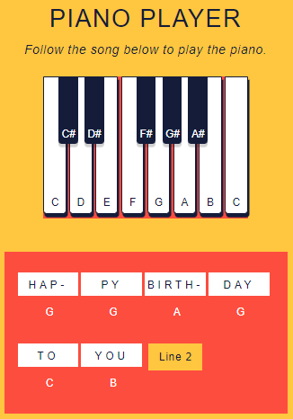

# DOM Events - Piano Keys

Create an interactive game to help beginner-level piano students to study. Create a piano player with DOM events in JavaScript!
- [Online page - Codepen](https://codepen.io/ByronMike/pen/JjvzREp)

## Table of content
1. [General information](#General-information)
2. [Technologies](#Technologies)
3. [Setup](#Setup)
4. [Status](#Status)
5. [Contact](#Contact)

## General information

Codecademy instructions :
> You’re a web developer who has been hired by a music education company. This client wants you to create an interactive game to help their beginner-level piano students study. Create a piano player with DOM events in JavaScript!

Illustration:

## Technologies
**Tools:**
 * Code editor : **Visual Studio Code**
 * Version control system : **GIT**
 * Site hosting : **GITHUB**
  
**Languages :**
 * Web : **JS**
 
## Setup
1. Install Node.js
2. Open the command line in the same directory as the index.js script you created (use VS Code to do this automatically with the integrated terminal).

## Status
:heavy_check_mark: This project was validated on Septembre 26, 2022.

## Contact
* [Email](mailto:auger.michaell@gmail.com)
* [GitHub](https://github.com/ByronMike)
* [LinkedIn](https://www.linkedin.com/in/auger-michael/)